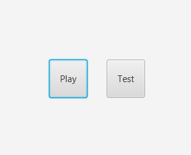
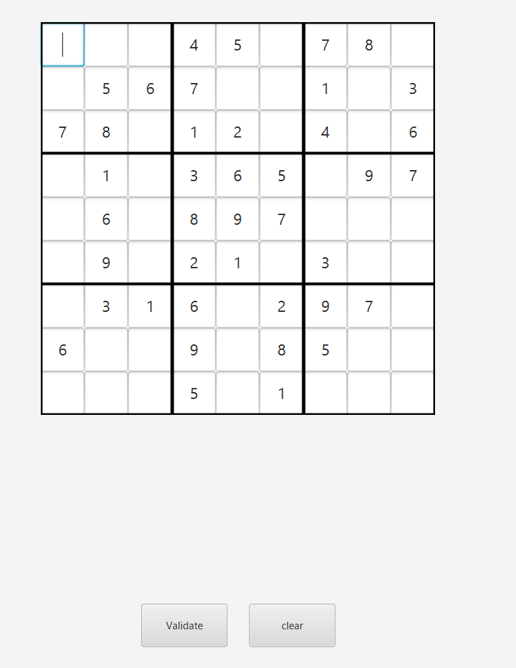
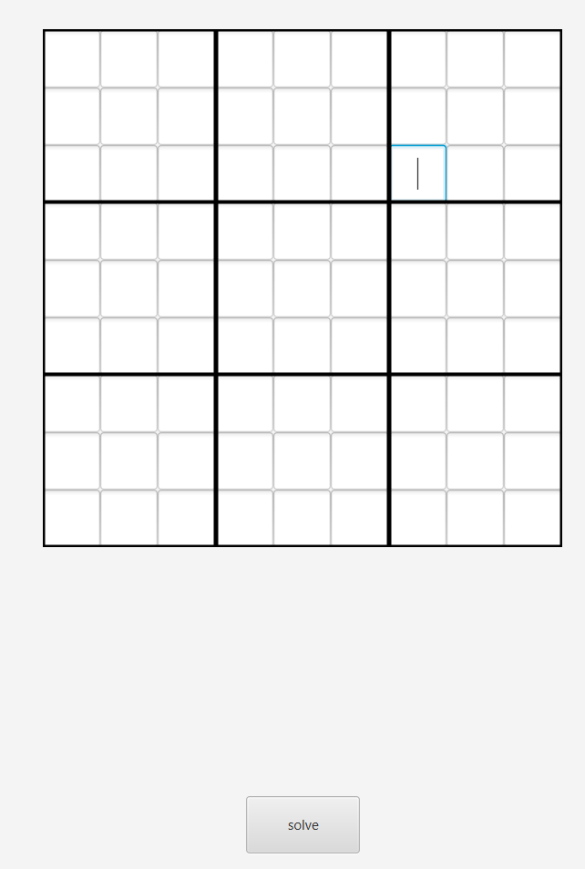

# Sudoku Solver

## Project Overview

This Sudoku Solver is a JavaFX application designed to provide an interactive experience for users to play and solve Sudoku puzzles. The application features two main functionalities:

1. **Play Mode**: Users can generate a Sudoku puzzle to play. They can fill in the grid and validate their solution to check for correctness.

2. **Test Mode**: Users can input their own Sudoku puzzle, and the application will use an algorithm to solve the board and display the completed solution.

## Features

- **Play Mode**: 
  - Generates a new Sudoku puzzle for the user to solve.
  - Allows users to input their answers.
  - Includes a validation feature to check if the solution is correct.

- **Test Mode**: 
  - Accepts a custom Sudoku puzzle from the user.
  - Solves the provided puzzle using an efficient solving algorithm based on backtracking.
  - Displays the solved board to the user.

## How It Works

The Sudoku Solver leverages data structures and algorithms (DSA) concepts, particularly **backtracking**, to efficiently solve the puzzles. Backtracking is used to explore possible numbers for each cell and backtrack if a conflict is detected, ensuring a correct solution is found.

## How to Use

1. **Play Mode**:
   - Click the **Play** button to generate a new Sudoku puzzle.
   - Fill in the empty cells with numbers from 1 to 9.
   - Use the validation feature to check if your solution is correct.

2. **Test Mode**:
   - Click the **Test** button to input your custom Sudoku puzzle.
   - Enter the known numbers into the grid.
   - The application will solve the puzzle using backtracking and display the solution.

## Technologies Used

- **Java**: The core programming language used for developing the application.
- **JavaFX**: For creating the graphical user interface.

## Future Enhancements

- Implement difficulty levels for generated puzzles.
- Add a hint feature to assist users in solving puzzles.
- Improve the user interface for a more interactive experience.

# Sudoku Solver

## Example Interface

<table>
  <tr>
    <th>Home</th>
  </tr>
  <tr>
    <td></td>
  </tr>
  <tr>
    <th>Play</th>
    <th>Test</th>
  </tr>
  <tr>
    <td></td>
    <td></td>
  </tr>
</table>

## Project Overview

This Sudoku Solver is a JavaFX application designed to provide an interactive experience for users to play and solve Sudoku puzzles. The application features two main functionalities:

1. **Play Mode**: Users can generate a Sudoku puzzle to play. They can fill in the grid and validate their solution to check for correctness.

2. **Test Mode**: Users can input their own Sudoku puzzle, and the application will use an algorithm to solve the board and display the completed solution.

... [rest of the README content] ...

## Contributing

Contributions are welcome! Please fork this repository and submit a pull request for any bug fixes or feature enhancements.
